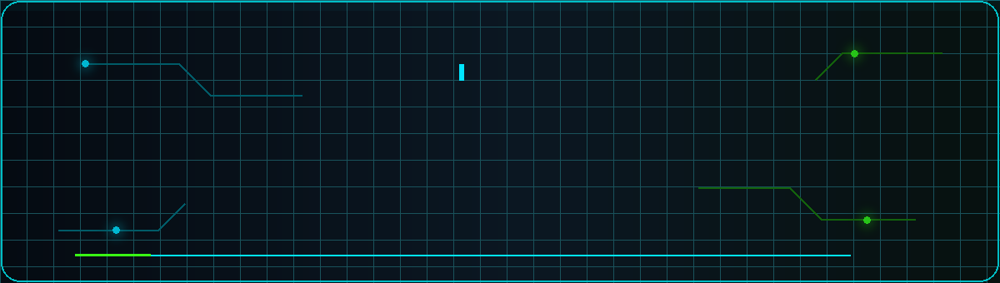

  

## `$ whoami`

I'm **Jason**, also known as **CyberCoder-bit**—a cybersecurity competitor and student developer. I enjoy solving CTF challenges, building tools that automate the boring parts, and turning complicated solutions into clear, reproducible write-ups.

- 🔐 Exploring **cryptography, forensics, web security, reverse engineering, and binary exploitation**
- 🐍 Building scripts and security tooling primarily with **Python**
- 🧠 Learning more about **AI/ML, low-level systems, and secure software development**
- 📝 Publishing write-ups so other people can learn from the process

## `> featured_work`

| Project | What you'll find |
| --- | --- |
| [**ICO 2026 Writeups**](https://github.com/CyberCoder-bit/ICO-2026-Writeup) | Solutions and notes from the International Cybersecurity Olympiad |
| [**LIT CTF 2026**](https://github.com/CyberCoder-bit/LIT-CTF-2026) | Write-ups covering cryptography, misc, and web challenges |
| [**OmniCTF 2026 Quals**](https://github.com/CyberCoder-bit/OmniCTF-2026-Quals-Writeups) | Forensics and miscellaneous challenge write-ups from the qualifiers |

## `> toolbox`

  

 

## `> github_stats`

  <picture>
    <source
      srcset="https://github-stats-extended.vercel.app/api?username=CyberCoder-bit&show_icons=true&hide_border=true&bg_color=00000000&title_color=00E5FF&text_color=C9D1D9&icon_color=39FF14&rank_icon=github"
      media="(prefers-color-scheme: dark)"
    />
    <source
      srcset="https://github-stats-extended.vercel.app/api?username=CyberCoder-bit&show_icons=true&hide_border=true&bg_color=00000000&title_color=007C91&text_color=24292F&icon_color=15803D&rank_icon=github"
      media="(prefers-color-scheme: light), (prefers-color-scheme: no-preference)"
    />
    
  </picture>
  <picture>
    <source
      srcset="https://github-stats-extended.vercel.app/api/top-langs/?username=CyberCoder-bit&layout=compact&hide_border=true&bg_color=00000000&title_color=00E5FF&text_color=C9D1D9"
      media="(prefers-color-scheme: dark)"
    />
    <source
      srcset="https://github-stats-extended.vercel.app/api/top-langs/?username=CyberCoder-bit&layout=compact&hide_border=true&bg_color=00000000&title_color=007C91&text_color=24292F"
      media="(prefers-color-scheme: light), (prefers-color-scheme: no-preference)"
    />
    
  </picture>

## `> connect`

I'm interested in collaborating on **CTFs, cybersecurity tools, and security-focused open-source projects**. The best way to reach me is through an issue or discussion on one of my repositories.

  Learn deeply. Build carefully. Document clearly.

